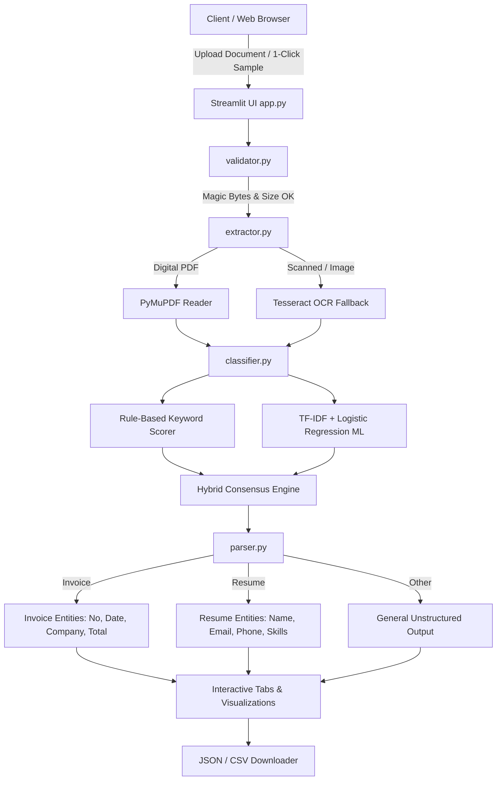

# ⚡ Zyroo AI Document Intelligence Platform

> **Zyroo AI/ML Internship • Task 2 — Automated Document Classification, Information Extraction & Workflow MVP**

---

## 📌 Overview

The **Zyroo AI Document Intelligence Platform** is an enterprise-grade, portfolio-ready document processing MVP built for the Zyroo AI/ML Internship program. The application ingests diverse digital documents (PDFs, PNG, JPG), performs fast native text extraction with OCR fallback for scanned materials, classifies document types into **Invoice**, **Resume**, or **Other** using a hybrid Rule-Based and Machine Learning (TF-IDF + Logistic Regression) pipeline, extracts key business entities, and renders fully explainable results in an interactive SaaS-grade Streamlit interface.

---

## 🎯 Problem Statement

Modern enterprise operations process thousands of unstructured and semi-structured documents daily—invoices, candidate resumes, contracts, and memos. Manual verification is error-prone, time-consuming, and expensive. Organizations require a unified, transparent system that:
1. Validates and ingests arbitrary documents safely.
2. Extracts high-fidelity text across digital and scanned formats.
3. Automatically identifies the document type with quantified confidence.
4. Parses critical structured fields (e.g., Invoice Number, Total Amount, Candidate Email, Skills Taxonomy).
5. Provides **Explainable AI (XAI)** so auditors understand *why* decisions were made.

---

## 💡 Solution

This platform delivers an end-to-end processing pipeline adhering to production software engineering and AI/ML standards:
- **Fast Ingestion & Security**: Enforces file format whitelisting (`.pdf`, `.png`, `.jpg`, `.jpeg`), size caps (10 MB), and binary magic-byte verification (`%PDF`, PIL image integrity).
- **Dual-Mode Text Extraction**: High-speed digital text extraction via **PyMuPDF (`fitz`)** (< 15 ms latency) with seamless **Tesseract OCR fallback** for scanned images.
- **Explainable Classification**: Dual-strategy classifier combining deterministic keyword heuristics with a calibrated **Scikit-Learn TF-IDF + Logistic Regression** model.
- **Entity Extraction**: Robust multi-currency parsing (PKR, USD, EUR, INR) and regex/NLP entity recognition for invoices and resumes with context snippet capture.
- **1-Click Sample Gallery**: Pre-loaded authentic test documents allowing evaluators and recruiters to test the full pipeline in a single click.

---

## ✨ Key Features

- **Multi-Format Upload**: Seamless drag-and-drop support for PDF, PNG, JPG, JPEG documents.
- **Pre-Loaded Sample Showcase**: Includes 4 synthetic test documents directly matching the Zyroo Task 2 specification:
  - `invoice_001.pdf`: Exact specification sample (ABC Technologies, PKR 125,000, INV-1024, dated 02-09-2026).
  - `invoice_002.pdf`: Commercial multi-item cloud infrastructure invoice ($4,850.00).
  - `resume_001.pdf`: Senior AI/ML Engineer resume with 20+ detected tech skills.
  - `sample_other.pdf`: Architecture memo edge case testing "Other" document categorization.
- **Dual Classification Engines**:
  - **Rule-Based Scoring**: Weighted keyword matches with normalized probability distributions.
  - **Machine Learning (TF-IDF + Logistic Regression)**: Trained pipeline providing feature importance / n-gram attribution.
  - **Hybrid Consensus**: Intelligent ensemble weighting heuristics and ML outputs.
- **Structured Entity Extraction**:
  - **Invoices**: Invoice Number, Date, Company / Billed-To Name, Total Amount Due.
  - **Resumes**: Candidate Name, Email Address, Phone Number, Categorized Skills Matrix (AI/ML, Programming, Cloud, Databases).
- **Interactive Data Visualization**: Plotly interactive charts for keyword signals and class probability distributions.
- **Data Export**: One-click download of parsed structured results as standardized **JSON** or **CSV**.
- **Automated Test Suite**: 25 automated pytest tests covering validation, extraction, classification, parsing, and end-to-end flows.

---

## 🔄 How It Works

```
USER UPLOAD / SAMPLE SELECTOR
            │
            ▼
┌───────────────────────────────┐
│   1. Security Validation      │  --> Checks size, extension, & magic bytes
└──────────────┬────────────────┘
               │ Validated
               ▼
┌───────────────────────────────┐
│   2. Text Extraction / OCR    │  --> PyMuPDF direct extract; OCR fallback
└──────────────┬────────────────┘
               │ Text Payload
               ▼
┌───────────────────────────────┐
│   3. Document Classification  │  --> Hybrid: Rule-based + TF-IDF Logistic Reg
└──────────────┬────────────────┘
               │ Document Type (Invoice / Resume / Other)
               ▼
┌───────────────────────────────┐
│   4. Entity Parsing Engine    │  --> Regex patterns, currency, & skill taxonomy
└──────────────┬────────────────┘
               │ Structured Entities + Metadata
               ▼
┌───────────────────────────────┐
│   5. Streamlit Presentation   │  --> Interactive KPI cards, Plotly charts, & export
└───────────────────────────────┘
```

---

## 🏗️ Architecture



---

## 🛠️ Tech Stack

| Layer | Technology | Purpose |
| :--- | :--- | :--- |
| **Frontend / Dashboard** | Streamlit 1.35+ | Modern responsive web UI with custom CSS |
| **PDF Processing** | PyMuPDF (`pymupdf`) | High-speed native vector PDF text extraction |
| **OCR Fallback** | PyTesseract / Pillow | Optical character recognition for scanned media |
| **Machine Learning** | Scikit-Learn 1.4+ | TF-IDF vectorization & Logistic Regression |
| **Data & Computation** | Pandas 2.1+, NumPy | Dataframes, matrix operations, CSV exporting |
| **Visualization** | Plotly 5.18+ | Interactive keyword and probability charts |
| **Testing** | Pytest 8.0+ | Automated unit, edge-case, and integration tests |

---

## 📁 Project Structure

```
zyroo-document-intelligence/
│
├── app.py                      # Masterpiece Streamlit application
├── requirements.txt            # Pinned dependencies
├── README.md                   # Comprehensive portfolio documentation
├── .gitignore                  # Standard Python / IDE exclusions
├── .env.example                # Safe environment configuration template
│
├── src/
│   ├── __init__.py             # Package marker
│   ├── config.py               # Visual theme, keywords, regex patterns, taxonomy
│   ├── validator.py            # Upload constraints, magic byte verification
│   ├── extractor.py            # PyMuPDF text reader & OCR fallback
│   ├── classifier.py           # Rule-based & TF-IDF Logistic Regression classifiers
│   ├── parser.py               # Invoice and Resume entity extraction engine
│   └── sample_generator.py     # Synthetic test PDF document generator
│
├── samples/                    # Authentic sample PDFs for evaluation
│   ├── invoice_001.pdf         # Official Zyroo sample (ABC Technologies / PKR 125,000)
│   ├── invoice_002.pdf         # Multi-item cloud invoice ($4,850.00)
│   ├── resume_001.pdf          # Senior AI/ML Engineer resume
│   └── sample_other.pdf        # Architecture memo (Other category)
│
└── tests/                      # Automated test suite (25 test cases)
    ├── test_validator.py       # Validation logic & edge cases
    ├── test_extractor.py       # Text extraction & format handling
    ├── test_classifier.py      # Rule-based and ML classifier tests
    ├── test_parser.py          # Entity parsing for invoices and resumes
    └── test_end_to_end.py      # Full integration tests across all sample docs
```

---

## 🚀 Installation

### 1. Clone or Navigate to the Repository
```bash
git clone https://github.com/Sakthibalan-S/zyroo-document-intelligence.git
cd zyroo-document-intelligence
```

### 2. Create and Activate Virtual Environment
```bash
# Windows
python -m venv .venv
.venv\Scripts\activate

# Linux / macOS
python3 -m venv .venv
source .venv/bin/activate
```

### 3. Install Dependencies
```bash
pip install -r requirements.txt
```

---

## ⚙️ Environment Setup

Copy `.env.example` to `.env`:
```bash
cp .env.example .env
```
Default configuration values work immediately out-of-the-box. If Tesseract OCR is installed at a custom path, configure `TESSERACT_CMD` in `.env`.

---

## 🖥️ Running Locally

Launch the Streamlit dashboard:
```bash
streamlit run app.py
```
The application will open automatically in your browser at `http://localhost:8501`.

---

## 🧪 Testing

Execute the complete automated test suite with pytest:
```bash
pytest tests/ -v
```

### Test Suite Summary:
```
tests/test_classifier.py::test_rule_based_invoice PASSED                 [  4%]
tests/test_classifier.py::test_rule_based_resume PASSED                  [  8%]
tests/test_classifier.py::test_rule_based_other PASSED                   [ 12%]
tests/test_classifier.py::test_ml_classifier_invoice PASSED              [ 16%]
tests/test_classifier.py::test_ml_classifier_resume PASSED               [ 20%]
tests/test_classifier.py::test_hybrid_classifier_consensus PASSED        [ 24%]
tests/test_end_to_end.py::test_e2e_invoice_001 PASSED                    [ 28%]
tests/test_end_to_end.py::test_e2e_invoice_002 PASSED                    [ 32%]
tests/test_end_to_end.py::test_e2e_resume_001 PASSED                     [ 36%]
tests/test_end_to_end.py::test_e2e_sample_other PASSED                   [ 40%]
tests/test_extractor.py::test_extract_invoice_pdf PASSED                 [ 44%]
tests/test_extractor.py::test_extract_resume_pdf PASSED                  [ 48%]
tests/test_extractor.py::test_extract_unsupported_format PASSED          [ 52%]
tests/test_extractor.py::test_extract_corrupted_pdf PASSED               [ 56%]
tests/test_parser.py::test_parse_complete_invoice PASSED                 [ 60%]
tests/test_parser.py::test_parse_invoice_missing_fields PASSED           [ 64%]
tests/test_parser.py::test_parse_complete_resume PASSED                  [ 68%]
tests/test_parser.py::test_parse_other_document PASSED                   [ 72%]
tests/test_validator.py::test_validate_valid_pdf PASSED                  [ 76%]
tests/test_validator.py::test_validate_empty_file PASSED                 [ 80%]
tests/test_validator.py::test_validate_empty_filename PASSED             [ 84%]
tests/test_validator.py::test_validate_unsupported_extension PASSED      [ 88%]
tests/test_validator.py::test_validate_oversized_file PASSED             [ 92%]
tests/test_validator.py::test_validate_corrupted_pdf_header PASSED       [ 96%]
tests/test_validator.py::test_validate_corrupted_image PASSED            [100%]

======================= 25 passed in 5.64s =======================
```

---

## 📊 Sample Inputs & Outputs

### 1. Sample Invoice (`invoice_001.pdf` — Official Task 2 Spec)
- **Input**:
  - Filename: `invoice_001.pdf`
  - Bill To: `ABC Technologies Global Ltd.`
  - Line Items: AI Document Intelligence MVP Development (PKR 75,000), Automated OCR Pipeline (PKR 50,000)
- **Extracted Output**:
  - **Document Type**: `Invoice` (Confidence: 99.0%, High Confidence)
  - **Invoice Number**: `INV-1024`
  - **Date**: `02-09-2026`
  - **Company / Client**: `ABC Technologies Global Ltd`
  - **Total Amount**: `PKR 125,000`

### 2. Sample Resume (`resume_001.pdf`)
- **Input**:
  - Filename: `resume_001.pdf`
  - Candidate: `Alex Morgan`
- **Extracted Output**:
  - **Document Type**: `Resume` (Confidence: 99.0%, High Confidence)
  - **Candidate Name**: `Alex Morgan`
  - **Email**: `alex.morgan@example.com`
  - **Phone**: `+1-555-019-2834`
  - **Detected Skills (24 Technologies)**: Python, PyTorch, TensorFlow, Scikit-Learn, Docker, Kubernetes, FastAPI, Flask, PostgreSQL, MongoDB, Redis, AWS, Google Cloud, etc.

---

## ⚠️ Limitations

1. **Scanned Images**: Text extraction from non-selectable PDFs and images relies on Tesseract OCR. If the system binary `tesseract.exe` is not installed on the host machine, the platform detects this gracefully and informs the user rather than throwing an unhandled exception.
2. **Complex Layouts**: Highly unconventional multi-column table hierarchies may require deep learning layout models (e.g., LayoutLMv3) for fine-grained cell-by-cell bounding boxes.

---

## 🔮 Future Improvements

- **LayoutLM / Multimodal Vision**: Integration of vision-language transformers for bounding-box coordinate mapping.
- **REST API Service**: FastAPI microservice wrapper (`POST /api/documents/upload`) for headless programmatic ingestion.
- **Automated Webhook Integration**: ERP and CRM webhooks to forward extracted invoice totals to QuickBooks or Xero.

---

## 🌐 Deployment

### Streamlit Community Cloud (Recommended)
1. Push repository to GitHub (`main` branch).
2. Visit [share.streamlit.io](https://share.streamlit.io).
3. Connect repository and select `app.py` as the entrypoint.
4. Deploy!

### Docker Container
```dockerfile
FROM python:3.11-slim
WORKDIR /app
COPY requirements.txt .
RUN pip install --no-cache-dir -r requirements.txt
COPY . .
EXPOSE 8501
CMD ["streamlit", "run", "app.py", "--server.port=8501", "--server.address=0.0.0.0"]
```

---

## 👨‍💻 Author & Internship Details

- **Intern**: Sakthibalan S
- **Program**: Zyroo AI/ML Internship (8-Week Cohort)
- **Task**: Task 2 — Document Intelligence Platform MVP
- **Organization**: [Zyroo (zyroo.org)](https://zyroo.org)
- **Community**: [Zyroo WhatsApp Community](https://chat.whatsapp.com/EfivEcFI4cJ8pWnbW9OmWh)
